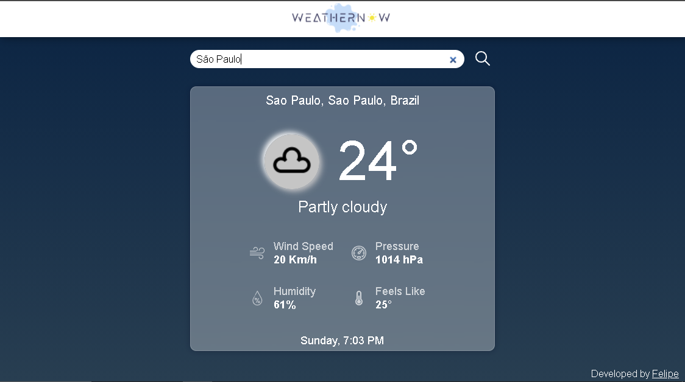

<h1 align="center">
  Weather Now
</h1>

<div align="center">
  
  
  
</div>


<p align="center">
  <a href="#About">About</a>&nbsp;&nbsp;&nbsp;|&nbsp;&nbsp;&nbsp;
  <a href="#Motivation">Motivation</a>&nbsp;&nbsp;&nbsp;|&nbsp;&nbsp;&nbsp;
  <a href="#Requirements">Requirements</a>&nbsp;&nbsp;&nbsp;|&nbsp;&nbsp;&nbsp;
  <a href="#How-to-use">How to use</a>&nbsp;&nbsp;&nbsp;|&nbsp;&nbsp;&nbsp;
  <a href="#License">License</a>
</p>

## About

A WEB page for displaying climatic data for a given region, using the [Weatherstack API](weatherstack.com) for consulting the information.

<div align="center">
  
</div>

## Motivation

This project was made for a challenge made by a job selection process.

## Requirements

To run this project you'll need the following programs installed on your machine:

+ [Node](https://nodejs.org/en/download/)
+ [Angular CLI](https://cli.angular.io/) `npm install -g @angular/cli`

## How to use

### Install and run the project
  To install and run the project, execute in your prompt the following commands:

  ```shell
  git clone https://github.com/felipedev1/weather-now.git

  cd weather-now

  npm install

  ng serve
  ```

  This will open your browser at the link `http://localhost:4200/`

  ### Backend
  
  The page also has a backend dependency, but the main features work without it. Link to the backend: https://github.com/felipedev1/cities-weatherstack-api

## License

This project is under the MIT license. See the [LICENSE](https://github.com/felipedev1/weather-now/blob/master/LICENSE) for details.